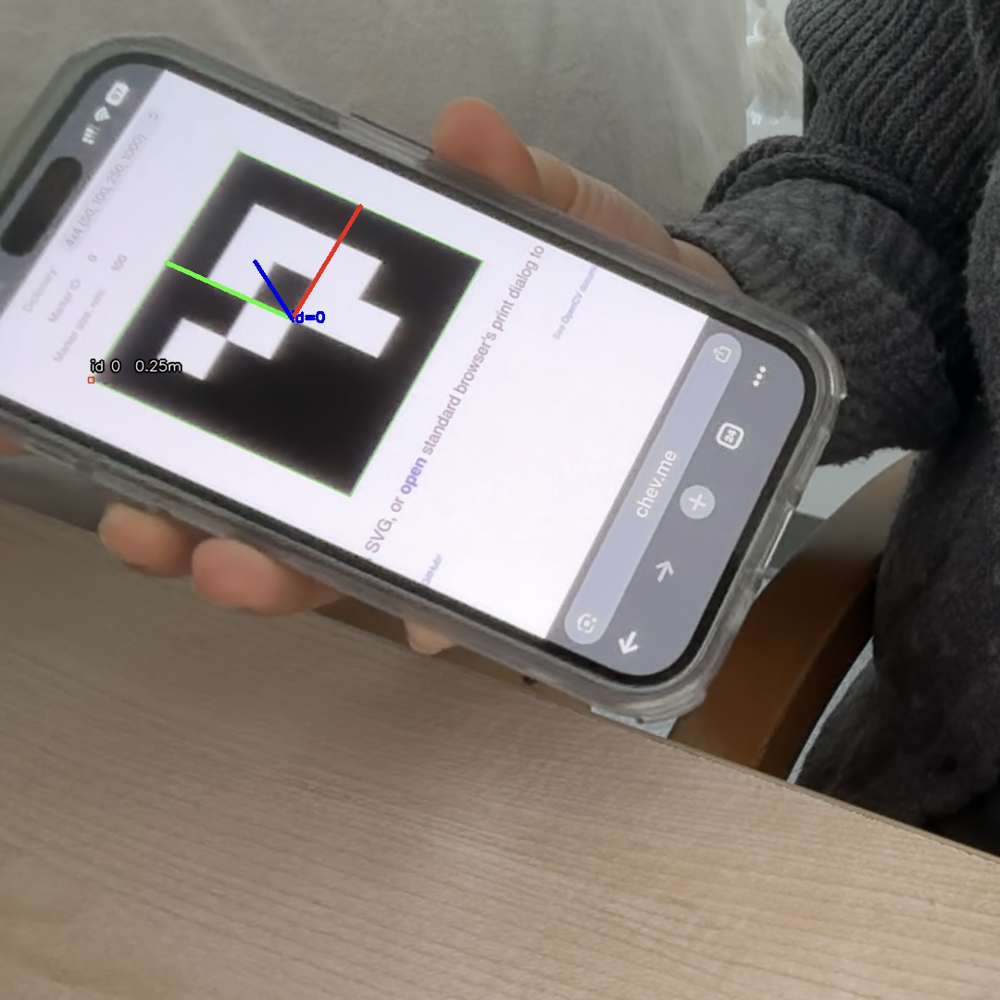
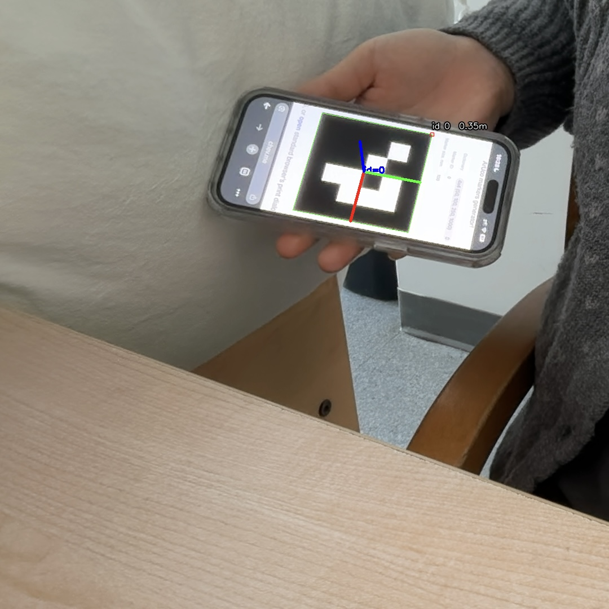

# ArUco Tag AR Demo (Pyton + OpenCV)
A small tech demo that detects ArUco markers from a webcam feed and estimates each tag's pose (position + rotation).
Goal: build an intuition for how camera -> marker -> pose works.

## Overview
### What this demo does
- Detects AruCo tags in real-time
- Draws marker borders + IDs
- Estimates pose and overlays axes on each detected tag

### Requirements
- Python 3.10+
- OpenCV with contrib modules
- Numpy

## Demo Screenshot

